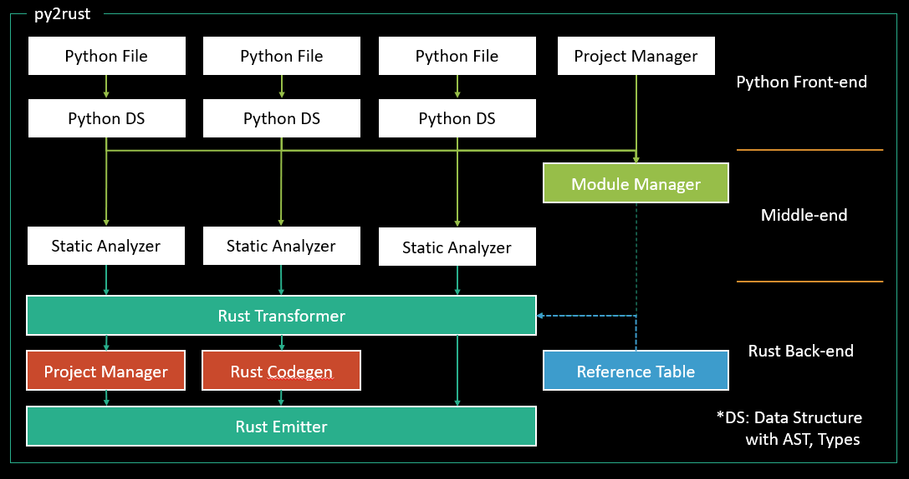

# py2rust design



2019/12/22 Concept

## Summary

## Motivation

The reason for starting this project is to create a general-purpose transpiler by 
researching and developing the `py2rust` transpiler.

Moving the development environment is a very expensive.
Therefore, in most cases, one of the following two is used.
For example, to use `LLVM` in `python`, we need the python-llvm wrapping library, 
and to use python in `C++` you need a virtual machine.
In the latter case, we will use most of them to run simple scripts that donnot need performance.

---

# Design Specification of py2rust

## 1. Type

### 1.1. Pirimitive Types

#### 1.1.1. Rust

https://doc.rust-lang.org/std/#primitives

```
bool
never
char
unit
pointer
array
slice
str
tuple
f32
f64
i8
i16
i32
i64
i128
u8
u16
u64
u128
isize
usize
ref
fn
```

#### 1.1.2. Python

https://docs.python.org/3/library/stdtypes.html

### 1.2. Type system for py2rust

#### 1.2.1. Type Class

#### 1.2.2. Type Hint

#### 1.2.3. Tag

## 2. Static Analysis

### 2.1. Static Type Inference

#### 2.1.1. Type Trace

If the type is not specified at the same time as the declaration, it must be marked with de-reference action.

``` python
Score = None # <= Cannot be determined type at this time.

# If Block -- Start
if Grade == 'A':
  Score = 4.0
elif Grade == 'B':
  Score = 3.4
else:
  Score = 2.0
# If Block -- End

# Still donot have to know the type of Score.

print(f'{}'.format(Score)) # Now we must know what Score type is.
                           # and propagate type and lifetime to where it is first used.
```

When analyzing If statement, we can pass the type information needed to infer the type of `Score`.

### 2.2. Dynamic Type Inference

``` python
def iff(x, a, b):
  if x == 0:
    return a
  else:
    return b
Z = iff(5, 0, "0")

C = any_function(Z, ...)
```

What is return type of `iff` function?

#### 2.2.1. Symbolic Execution

The return type of the `iff` function cannot be determined at compile time.
Therefore, at compile time, the function's execution path must be analyzed to break the function like this.

``` python
C = None
if 5 == 0:
  C = any_function(0: i32, ...)
else:
  C = any_function("0": &str, ...)

print(f'{}'.format(C))
```

Nevertheless, it can be seen that the type of `Z` was not determined.
Now we need to find all the parts where Z is used and recursively break up the statements.
Since inlining code by analyzing all the control paths(CFG) of a function is very expensive, so it is assumed that a function has only one return type, and the symbolic exeuction is performed only in special cases.

#### 2.2.2. Type Capsulation

``` python
```

### 2.3. Exception Handling

### 2.4. Lifetime Checker

### 2.5. Multi-thread Handling

## 3. Rust Codegen

### 3.1. Reference Table

The Reference Table is an API pattern matching helper to prevent reimplementation of stdlib or other libraries.
`Reference Table` is the most important part of the transpiler, so implementing this is key point of this project.

#### 3.1.1. Reference Table Grammar

##### 3.1.1.1. String Format Translation

Each compiler provides different string formatting methods. (Ex, f'a={}'.format("a"))
And, the format of `regular expressions` used in `python` is different from `rust`.

#### 3.1.2. Reference Table Autogen

There is a difficulty in automating because the reference table has a constraint that must be written `logically`.

#### 3.1.3. Pattern Matching

##### 3.1.3.1. Meet in the Middle Pattern Matching for General Transpiler

### 3.2. Rust Transformer

## 4. Project and Module Manager

---

# 